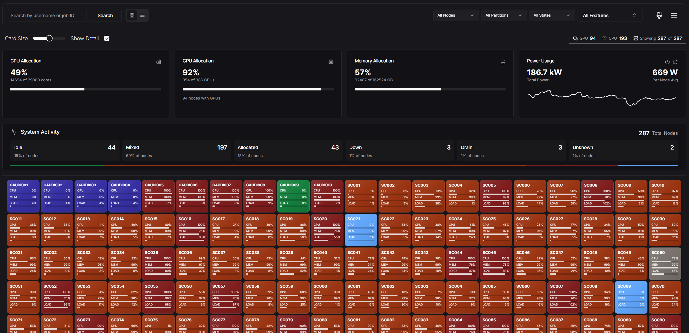

# Slurm Node Dashboard

[](https://www.gnu.org/licenses/gpl-3.0)
[](https://nodejs.org/)
[](https://nextjs.org/)

> A Next.js dashboard for operating Slurm clusters, with a configurable AI assistant built for HPC workflows.

Slurm Node Dashboard combines a live node view with optional historical analytics, GPU reporting, software modules, and a configurable Slurm assistant that can answer questions, call cluster tools, and be managed from the admin UI.



## Highlights

- Live cluster view with CPU/GPU node status, filtering, rack/group layouts, and 15 second refresh polling
- Optional feature-flagged pages for software modules, cluster rewind, and job metrics
- GPU analytics from Prometheus/DCGM recording rules, including job-level utilization views
- AI assistant with streaming chat, built-in Slurm workflow tools, documentation search, and structured tool result cards
- Admin-managed assistant configuration with YAML overrides, custom tools, restricted topics, and prompt preview/testing
- Admin dashboard for partitions, reservations, QoS, plugins, hierarchy data, and LLM assistant settings

## Requirements

- Node.js 20.9.0 or newer
- npm
- Access to a Slurm REST API (`slurmrestd`)
- Optional: PostgreSQL for historical metrics, rewind, and hierarchy features
- Optional: Prometheus/DCGM metrics for GPU utilization features
- Optional: OpenAI-compatible API credentials for the assistant

Node 20 LTS and Node 22 both satisfy the current engine requirement.

## Quick Start

```bash
git clone https://github.com/thediymaker/slurm-node-dashboard.git
cd slurm-node-dashboard
npm install
```

Create a `.env.local` with the minimum local settings:

```env
NEXT_PUBLIC_BASE_URL=http://localhost:3020
BETTER_AUTH_SECRET=replace-with-a-long-random-string
ADMIN_USERNAME=admin
ADMIN_PASSWORD=change-me

CLUSTER_NAME=My Cluster
SLURM_SERVER=slurmrestd.example.edu
SLURM_SERVER_PORT=6820
SLURM_PROTOCOL=http
# Match the version exposed by your slurmrestd, for example v0.0.40
SLURM_API_VERSION=v0.0.40
SLURM_API_ACCOUNT=dashboard
SLURM_API_TOKEN=replace-with-your-token
```

Then start the app:

```bash
npm run dev
```

Open `http://localhost:3020`.

## Documentation

For full deployment, feature flag, AI assistant, GPU metrics, and historical data setup details, see [slurmdash.com](https://slurmdash.com).

The optional historical ingestor is documented in `slurm-history-ingestor/README.md` and `slurm-history-ingestor/DOCUMENTATION.md`.

## Contributing

Pull requests are welcome. Keep changes focused, run linting for touched areas, and include any relevant setup or behavior notes in the PR.

## License

This project is licensed under the GNU General Public License v3.0. See [LICENSE.md](LICENSE.md) for details.

## Support

- Documentation: [slurmdash.com](https://slurmdash.com)
- Issues: [GitHub Issues](https://github.com/thediymaker/slurm-node-dashboard/issues)
- Contact: Johnathan Lee - [john.lee@thediymaker.com](mailto:john.lee@thediymaker.com)

---

<p align="center">
  Made with ❤️ for HPC
</p>
